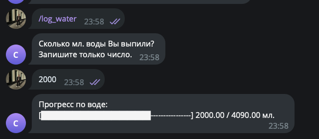
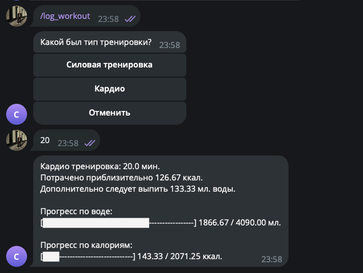

# Telegram-бот для расчёта нормы воды, калорий и трекинга активности

* src/forms - формы для состояний FSM
* src/handlers - все обработчики сообщений
* src/storage - хранилище данных о пользователях

Команда запуска из корня репозитория `python src/main.py `

# Скриншоты работы
### /start + /help

### /set_profile

### /show_profile

### /log_calories

### /log_water

### /log_workout

### /check_progress

